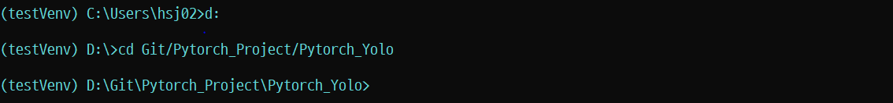
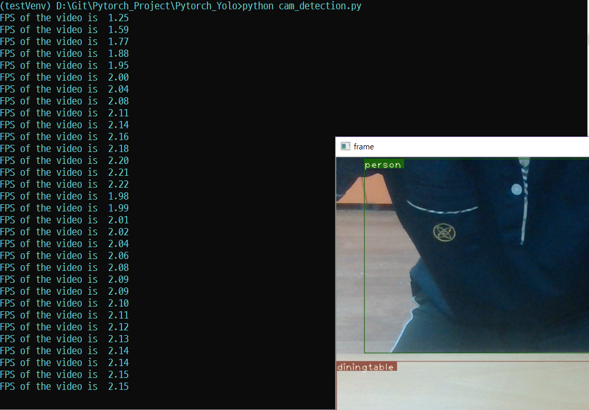
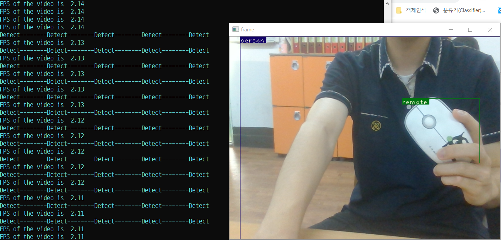

Pytorch_YOLO

##### `Pytorch`, `Yolov3`, `Python=3.6`, `Windows10`, `Object_Detection`

## 0. Index

1. 개요
2. **라이브러리** 설치
3. 소스 설명
4. **Yolov3** 다운로드
5. 실행


## 1. 개요

- **Pytorch**와 [**Yolov3**](https://pjreddie.com/media/files/papers/YOLOv3.pdf)를 이용한 **Object_Detection**(객체 검출)

- 사물을 인식한 뒤, 그 중 **개(dog)**가 인식되면 반응하도록 구현(**존재 유무 판단 중심**)

  ###### [ Detection Example ]


## 2. 라이브러리 설치

- ##### 설치해야할 라이브러리

  - **pytorch**(이미 상위 폴더의 [README](https://github.com/deongjin/Pytorch_Project/blob/master/README.md)에서 설치함)
  - **opencv-python**(OpenCV는 `오픈 소스 컴퓨터 비전 라이브러리`로,  `객체ㆍ얼굴ㆍ행동 인식`, `독순`, `모션 추적` 등의 응용 프로그램에서 사용)
  - **matplotlib**(시각화 라이브러리)
  - **pandas**(Python Data Analysis Library, 데이터 분석 라이브러리)

  

- ##### PIP를 이용한 라이브러리 설치

  - > **pip**는 파이썬으로 작성된 패키지 소프트웨어를 설치 · 관리하는 패키지 관리 시스템이다.

  - Anaconda Prompt를 실행한다

    

  - 가상환경 활성화/비활성화

    ```shell
    (base)C:\Users\(username)> conda activate (가상환경 이름)
    ```

    `conda activate`를 통해 설치 되어있는 Pytorch가 설치된 가상환경에 접속한 다.

  - pip install

    ```shell
    (testVenv)C:\Users\(username)> pip install opencv-python matplotlib pandas
    ```

    ###### [opencv-python]

    

    

    ###### [matplotlib]

    

    

    ###### [pandas]

    

- 설치확인

  ```shell
  (testVenv)C:\Users\(username)> pip list
  ```

  `pip list` 명령어를 통해 가상환경에 설치된 패키지를 확인할 수 있다.

  

## 3. 소스 설명

- ##### 파일종류

| Filename          |                         Usage                          |
| ----------------- | :----------------------------------------------------: |
| ./data/coco.names |                Object name list(호출용)                |
| bbox.py           |          Bounding Box 구현(객체 박스 그리기)           |
| cam_detection.py  |         Webcam을 이용한 실시간 객체 검출 소스          |
| darknet.py        |          Neural Network 프레임워크(오픈소스)           |
| pallete           |         Bounding Box Color Pallete(색 팔레트)          |
| preprocess.py     |        Image(Opencv) PreProcess(이미지 전처리)         |
| util.py           |          함수를 모아놓은 소스(호출해서 사용)           |
| *yolov3.weights   | 이미 교육된 Yolov3 모델파일(**4번**에서 별도 다운로드) |


- ##### cam_detection.py

  - **모듈 호출부분**

    ```python
    from __future__ import division
    import time
    import torch 
    import torch.nn as nn
    from torch.autograd import Variable
    import numpy as np
    import cv2 
    from util import *
    from darknet import Darknet
    from preprocess import prep_image, inp_to_image
    import pandas as pd
    import random 
    import argparse
    import pickle as pkl
    ```

    `from __future__ import division`  :   파이썬 2와 3의 버전 차이로 인해 생기는 문제를 방지하고 호환이 되도록 하기 위해 사용

    `import torch.~~` : pytorch, torch 모듈을 호출

    `import numpy` : 파이썬의 대규모 수학연산, 수치해석 모듈을 호출

    `import cv2` : 컴퓨터 비젼 라이브러리, Opencv 호출

    `import pandas` : 데이터 분석 라이브러리 pandas 호출

    `import argparse` : 사용자 친화적인 명령행 인터페이스를 쉽게 작성하도록 도와주는 명령행 파서 라이브러리 호출. [argparse 추가 정보](https://docs.python.org/ko/3/library/argparse.html)

  - **prep_image함수**

    ```python
    def prep_image(img, inp_dim):
        """
        Prepare image for inputting to the neural network.
    
        Returns a Variable
        """
        orig_im = img
        dim = orig_im.shape[1], orig_im.shape[0]
        img = cv2.resize(orig_im, (inp_dim, inp_dim))
        img_ = img[:,:,::-1].transpose((2,0,1)).copy()
        img_ = torch.from_numpy(img_).float().div(255.0).unsqueeze(0)
        return img_, orig_im, dim
    ```

    opencv를 사용하여 webcam을 통해 입력받은 이미지를 전처리해주는 함수이다.

  - **write 함수**

    ```python
    def write(x, img):
        global label_list
        c1 = tuple(x[1:3].int())
        c2 = tuple(x[3:5].int())
        cls = int(x[-1])
        label = "{0}".format(classes[cls])
        label_list.append(label)
        color = random.choice(colors)
        cv2.rectangle(img, c1, c2,color, 1)
        t_size = cv2.getTextSize(label, cv2.FONT_HERSHEY_PLAIN, 1 , 1)[0]
        c2 = c1[0] + t_size[0] + 3, c1[1] + t_size[1] + 4
        cv2.rectangle(img, c1, c2, color, -1)
        cv2.putText(img, label, (c1[0], c1[1] + t_size[1] + 4), cv2.FONT_HERSHEY_PLAIN, 1, [225,255,255], 1);
        return img
    
    ```

    `label_list`에 한 이미지에서 검출된 객체들의 입력을 추가한다. 또한 `cv2.rectangle`을 통해 제공된 이미지에서 class이름과 BoundingBox를 덮어서 반환한다.

  - **arg_parse 함수**

    ```python
    def arg_parse():
        """
        Parse arguements to the detect module
        
        """
        parser = argparse.ArgumentParser(description='YOLO v3 Cam Demo')
        parser.add_argument("--confidence", dest = "confidence", help = "Object Confidence to filter predictions", default = 0.25)
        parser.add_argument("--nms_thresh", dest = "nms_thresh", help = "NMS Threshhold", default = 0.4)
        parser.add_argument("--reso", dest = 'reso', help = 
                            "Input resolution of the network. Increase to increase accuracy. Decrease to increase speed",
                            default = "160", type = str)
        return parser.parse_args()
    ```

    명령줄 입력을 통해 사용할 수 있지만, 구현하는데 특별히 사용이 필요하지는 않다.

  - **main**

    ```python
    if __name__ == '__main__':
        ####
        dog_exist = 0
        cfgfile = "cfg/yolov3.cfg"  # config파일 선언
        weightsfile = "yolov3.weights"  # weight파일 선언
        num_classes = 80  # class개수 정의
    
        args = arg_parse()  # argparse를 이용해 명령행을 파싱해오도록 함수 실행
        confidence = float(args.confidence)  # confidence 변수에 --confidence값을 할당
        nms_thesh = float(args.nms_thresh)  # 이것도 --nms_thresh값 할당
        start = 0  # start는 0
        CUDA = torch.cuda.is_available()  # cuda가 사용가능한 상황인지
    
        num_classes = 80  # 클래스의 개수가 80개
        bbox_attrs = 5 + num_classes  # Bouding Box 속성
    
        model = Darknet(cfgfile)  # Darknet
        model.load_weights(weightsfile)  # Model에 weighs파일을 load해준다
    
        model.net_info["height"] = args.reso
        inp_dim = int(model.net_info["height"])
    
        assert inp_dim % 32 == 0
        assert inp_dim > 32
    
        if CUDA:
            model.cuda()  # Cuda를 사용중이면 model.cuda()
    
        model.eval()  # 모델 평가함수
    
        videofile = 'video.avi'  # videofile이름
    
        cap = cv2.VideoCapture(0)  # videoCapture(0) >> video 캡쳐변수 선언
    
        assert cap.isOpened(), 'Cannot capture source'
        # assert는 가정설정문, 뒤의 조건이 True가 아니면 AssertError를 발생시킨다.
    
        frames = 0
        # frame 변수 선언, 초기값은 0
    
        start = time.time()  # 시간을 측정해주는 함수
        while cap.isOpened():  # cap이 초기화가 잘 되어 있는지 확인
    
            ret, frame = cap.read()
            origin_frame = frame
    
            ####
            frame = cv2.flip(frame, 1)
            # cap.read()는 재생되는 비디오의 한 프레임씩 읽는다.
            # 제대로 읽었다면 ret값이 True가 되고, 실패하면 False.
            # 읽은 프레임은 frame이다.
    
            if ret:  # ret이 true라면, 제대로 읽었다면
    
                img, orig_im, dim = prep_image(frame, inp_dim)
    
                # im_dim = torch.FloatTensor(dim).repeat(1,2)
    
                if CUDA:
                    im_dim = im_dim.cuda()
                    img = img.cuda()
    
                output = model(Variable(img), CUDA)
                output = write_results(output, confidence, num_classes, nms=True, nms_conf=nms_thesh)
    
                if type(output) == int:
                    frames += 1
                    print("FPS of the video is {:5.2f}".format(frames / (time.time() - start)))
                    cv2.imshow("frame", orig_im)
                    key = cv2.waitKey(1)
                    if key & 0xFF == ord('q'):
                        break
                    continue
    
                output[:, 1:5] = torch.clamp(output[:, 1:5], 0.0, float(inp_dim)) / inp_dim
    
                # im_dim = im_dim.repeat(output.size(0), 1)
                output[:, [1, 3]] *= frame.shape[1]
                output[:, [2, 4]] *= frame.shape[0]
    
                classes = load_classes('data/coco.names')       #coco.names로부터 class의 이름을 불러온다
                colors = pkl.load(open("pallete", "rb"))        #pallete로부터 색깔을 불러온다.
    
                label_list = list()
    
                list(map(lambda x: write(x, orig_im), output))
    
                ####검출을 알려주는 소스
                if label_list.count('remote') >= 1:
                    dog_exist = 1
                else:
                    dog_exist = 0
    
                if dog_exist == 1:
                    print("Detect--------Detect--------Detect--------Detect--------Detect")
                    cv2.imwrite('remote.jpg', origin_frame)
                ####
    
    
                cv2.imshow("frame", orig_im)
    
                key = cv2.waitKey(1)
                if key & 0xFF == ord('q'):
                    break
                frames += 1
                print("FPS of the video is {:5.2f}".format(frames / (time.time() - start)))
                #소요시간을 time을 사용해서 FPS를 출력
    
            else:
            break
    ```
    
    특히 88열부터 97열까지의 소스는 직접 작성한 소스로, **Object_Detection**을 통해 인식된 Object들을 배열로 담아 그 중에 개(혹은 특정 Object)가 검출됬는지 판단, 알려주는 부분이다. 
    
    
    
    ###### [검출소스]
    
    ```python
    if label_list.count('remote') >= 1:
    	dog_exist = 1
    else:
    	dog_exist = 0
    
    if dog_exist == 1:
    	print("Detect--------Detect--------Detect--------Detect--------Detect")
    cv2.imwrite('remote.jpg', origin_frame)
    ```
    
    위의 `write`함수에서 선언 된 `label_list`에 현재 검출된 **Object**이름들을 담는다.
    
    ```python
    global label_list
    label_list.append(label)	##.append는 리스트에 Object이름들을 추가한다
    ```
    
    `label_list` 리스트 가운데 **dog**(현재는 remote)가 하나 이상 있다면, 검출된 것이기 때문에 검출됨을 나타내는 `Detect-------Detect`를 출력하도록 작성했다. 
    
    더불어, `cv2.imwrite('사진이름',origin_frame)`을 통해 검출될 때의 순간을 캡쳐할 수 있는 기능까지 구현했다.

## 4. Yolov3 다운로드

> **YOLO** = You Only Look Once
>
> **Object_Detection**에서 자주 사용되는, 개발자 **Joseph Redmon**가 개발한 딥러닝 오픈소스


- [Yolov3 Download](https://pjreddie.com/media/files/yolov3.weights)에 접속하여 `Yolov3.weight`를 설치한다.
- 설치한 `Yolov3.weight` 파일을 `Pytorch_Project/Pytorch_Yolo/`경로에 위치시킨다.

## 5. 실행

- ##### [ 2.라이브러리 설치 ] 참고, 가상환경 접속

- ##### Pytorch_Yolo 폴더로 접속

  - 저자의 경우 **D:드라이브 Git폴더안에 Pytorch_Project폴더**가 존재한다.

    ```shell
    (testVenv)C:\Users\(username)> d:
    ```

    `d:`를 통해 **D:드라이브로 이동**한다.

    ``` shell
    (testVenv)D:\> cd Git/Pytorch_Project/Pytorch_Yolo
    ```

    `cd`(change directory)를 사용하여 **Pytorch_Yolo 폴더로 이동**한다.

    

- ##### 실행

  ```shell
  (testVenv) D:\Git\Pytorch_Project\Pytorch_Yolo> python cam_detection.py
  ```

  가상환경에서 `cam_detection.py`이 실행된다.

  

  다음과 같이 **FPS**가 출력

  

  

  또 특정 사물(현재는 **remote**)(왜인지는 모르겠지만, 다른 마우스와 달리 나의 마우스는 **remote**로 인식을 함)을 코딩하면, `Detect------Detect-----....`가 출력이 되는 것을 볼 수 있다.

  > 실제 작품에서는 **Dog**에 반응하도록 코딩할 예정이다