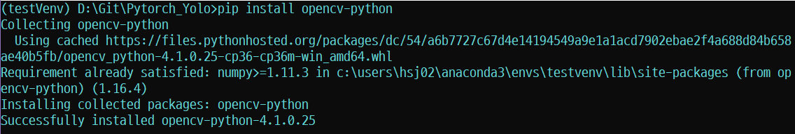
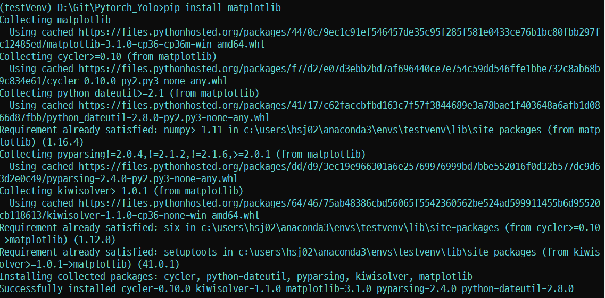
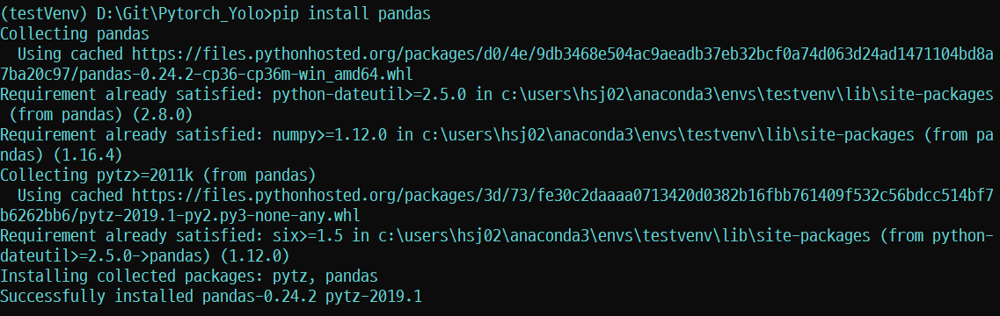
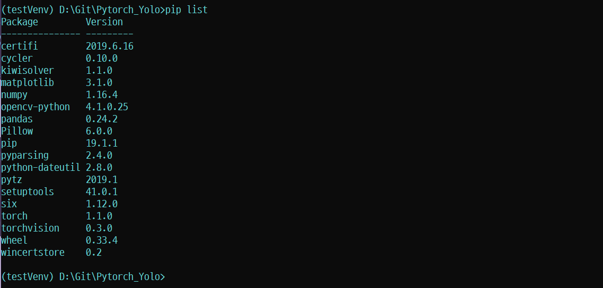
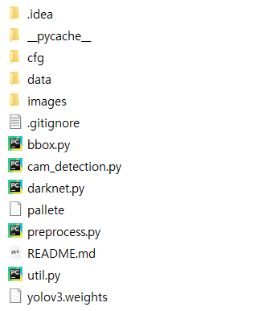

# Pytorch_YOLO

##### `Pytorch`, `Yolov3`, `Python=3.6`, `Windows10`, `Object_Detection`

## 0. Index

1. 개요
2. **라이브러리** 설치
3. 소스 설명
4. **Yolov3** 다운로드
5. 실행


## 1. 개요

- **Pytorch**와 [**Yolov3**](https://pjreddie.com/media/files/papers/YOLOv3.pdf)를 이용한 **Object_Detection**(객체 검출)

- 사물을 인식한 뒤, 그 중 개(dog)가 인식되면 반응하도록 구현(**존재 유무 판단 중심**)

  ###### [ Detection Example ]


## 2. 라이브러리 설치

- ##### 설치해야할 라이브러리

  - **pytorch**(이미 상위 폴더의 [README](https://github.com/deongjin/Pytorch_Project/blob/master/README.md)에서 설치함)
  - **opencv-python**(OpenCV는 `오픈 소스 컴퓨터 비전 라이브러리`로,  `객체ㆍ얼굴ㆍ행동 인식`, `독순`, `모션 추적` 등의 응용 프로그램에서 사용)
  - **matplotlib**(시각화 라이브러리)
  - **pandas**(Python Data Analysis Library, 데이터 분석 라이브러리)

  

- ##### PIP를 이용한 라이브러리 설치

  - > **pip**는 파이썬으로 작성된 패키지 소프트웨어를 설치 · 관리하는 패키지 관리 시스템이다.

  - Anaconda Prompt를 실행한다

  - 가상환경 활성화/비활성화

    ```shell
    (base)C:\Users\(username)> conda activate (가상환경 이름)
    ```

    `conda activate`를 통해 설치 되어있는 Pytorch가 설치된 가상환경에 접속한 다.

  - pip install

    ```shell
    (testVenv)C:\Users\(username)> pip install opencv-python matplotlib pandas
    ```

    ###### [opencv-python]

    

    

    ###### [matplotlib]

    

    

    ###### [pandas]

    

- 설치확인

  ```shell
  (testVenv)C:\Users\(username)> pip list
  ```

  `pip list` 명령어를 통해 가상환경에 설치된 패키지를 확인할 수 있다.

  

## 3. 소스 설명

- ##### 파일종류

| Filename          |                         Usage                          |
| ----------------- | :----------------------------------------------------: |
| ./data/coco.names |                Object name list(호출용)                |
| bbox.py           |          Bounding Box 구현(객체 박스 그리기)           |
| cam_detection.py  |         Webcam을 이용한 실시간 객체 검출 소스          |
| darknet.py        |          Neural Network 프레임워크(오픈소스)           |
| pallete           |         Bounding Box Color Pallete(색 팔레트)          |
| preprocess.py     |        Image(Opencv) PreProcess(이미지 전처리)         |
| util.py           |          함수를 모아놓은 소스(호출해서 사용)           |
| *yolov3.weights   | 이미 교육된 Yolov3 모델파일(**4번**에서 별도 다운로드) |




- ##### cam_detection.py

  - **모듈 호출부분**

    ```python
    from __future__ import division
    import time
    import torch 
    import torch.nn as nn
    from torch.autograd import Variable
    import numpy as np
    import cv2 
    from util import *
    from darknet import Darknet
    from preprocess import prep_image, inp_to_image
    import pandas as pd
    import random 
    import argparse
    import pickle as pkl
    ```

    `from __future__ import division`  :   파이썬 2와 3의 버전 차이로 인해 생기는 문제를 방지하고 호환이 되도록 하기 위해 사용

    `import torch.~~` : pytorch, torch 모듈을 호출

    `import numpy` : 파이썬의 대규모 수학연산, 수치해석 모듈을 호출

    `import cv2` : 컴퓨터 비젼 라이브러리, Opencv 호출

    `import pandas` : 데이터 분석 라이브러리 pandas 호출

    `import argparse` : 사용자 친화적인 명령행 인터페이스를 쉽게 작성하도록 도와주는 명령행 파서 라이브러리 호출. [argparse 추가 정보](https://docs.python.org/ko/3/library/argparse.html)

  - **prep_image함수**

    ```python
    def prep_image(img, inp_dim):
        """
        Prepare image for inputting to the neural network.
    
        Returns a Variable
        """
        orig_im = img
        dim = orig_im.shape[1], orig_im.shape[0]
        img = cv2.resize(orig_im, (inp_dim, inp_dim))
        img_ = img[:,:,::-1].transpose((2,0,1)).copy()
        img_ = torch.from_numpy(img_).float().div(255.0).unsqueeze(0)
        return img_, orig_im, dim
    ```

    opencv를 사용하여 webcam을 통해 입력받은 이미지를 전처리해주는 함수이다.

  - **write 함수**

    ```python
    def write(x, img):
        global label_list
        c1 = tuple(x[1:3].int())
        c2 = tuple(x[3:5].int())
        cls = int(x[-1])
        label = "{0}".format(classes[cls])
        label_list.append(label)
        color = random.choice(colors)
        cv2.rectangle(img, c1, c2,color, 1)
        t_size = cv2.getTextSize(label, cv2.FONT_HERSHEY_PLAIN, 1 , 1)[0]
        c2 = c1[0] + t_size[0] + 3, c1[1] + t_size[1] + 4
        cv2.rectangle(img, c1, c2, color, -1)
        cv2.putText(img, label, (c1[0], c1[1] + t_size[1] + 4), cv2.FONT_HERSHEY_PLAIN, 1, [225,255,255], 1);
        return img
    
    ```

    `label_list`에 한 이미지에서 검출된 객체들의 입력을 추가한다. 또한 `cv2.rectangle`을 통해 제공된 이미지에서 class이름과 BoundingBox를 덮어서 반환한다.

  - **arg_parse 함수**

    ```python
    def arg_parse():
        """
        Parse arguements to the detect module
        
        """
        parser = argparse.ArgumentParser(description='YOLO v3 Cam Demo')
        parser.add_argument("--confidence", dest = "confidence", help = "Object Confidence to filter predictions", default = 0.25)
        parser.add_argument("--nms_thresh", dest = "nms_thresh", help = "NMS Threshhold", default = 0.4)
        parser.add_argument("--reso", dest = 'reso', help = 
                            "Input resolution of the network. Increase to increase accuracy. Decrease to increase speed",
                            default = "160", type = str)
        return parser.parse_args()
    ```

    

## 4. Yolov3 다운로드

 [Yolov3 Download](https://pjreddie.com/media/files/yolov3.weights)

## 5. 실행


### On single or multiple images

Clone, and `cd` into the repo directory. The first thing you need to do is to get the weights file
This time around, for v3, authors has supplied a weightsfile only for COCO [here](https://pjreddie.com/media/files/yolov3.weights), and place 

the weights file into your repo directory. Or, you could just type (if you're on Linux)

```
wget https://pjreddie.com/media/files/yolov3.weights 
python detect.py --images imgs --det det 
```

`--images` flag defines the directory to load images from, or a single image file (it will figure it out), and `--det` is the directory
to save images to. Other setting such as batch size (using `--bs` flag) , object threshold confidence can be tweaked with flags that can be looked up with. 

```
python detect.py -h
```

### Speed Accuracy Tradeoff

You can change the resolutions of the input image by the `--reso` flag. The default value is 416. Whatever value you chose, rememeber **it should be a multiple of 32 and greater than 32**. Weird things will happen if you don't. You've been warned. 

```
python detect.py --images imgs --det det --reso 320
```

### On a Camera

Same as video module, but you don't have to specify the video file since feed will be taken from your camera. To be precise, 
feed will be taken from what the OpenCV, recognises as camera 0. The default image resolution is 160 here, though you can change it with `reso` flag.

```
python cam_demo.py
```

You can easily tweak the code to use different weightsfiles, available at [yolo website](https://pjreddie.com/darknet/yolo/)

NOTE: The scales features has been disabled for better refactoring.

### Detection across different scales

YOLO v3 makes detections across different scales, each of which deputise in detecting objects of different sizes depending upon whether they capture coarse features, fine grained features or something between. You can experiment with these scales by the `--scales` flag. 

```
python detect.py --scales 1,3
```

