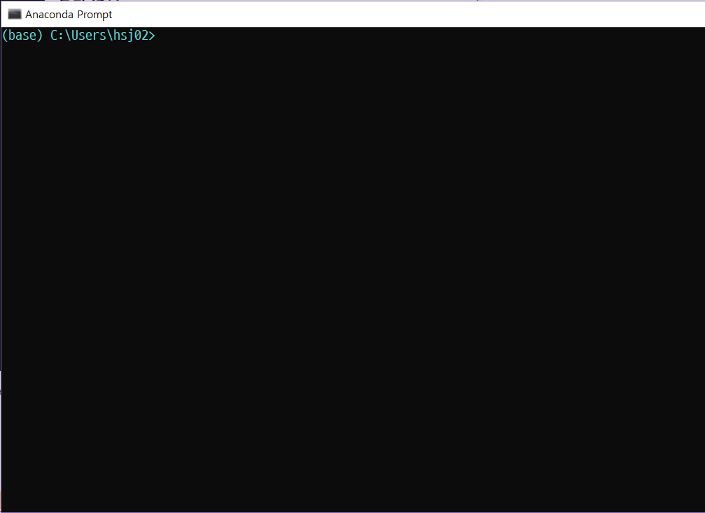
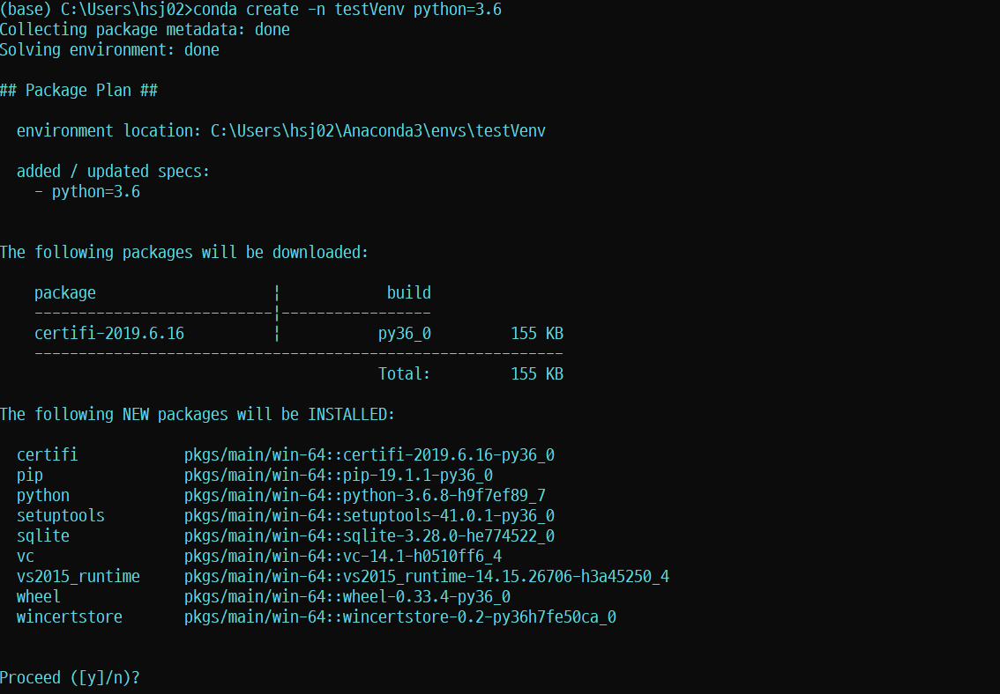
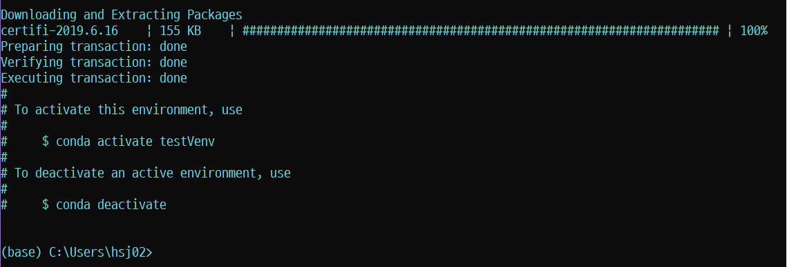
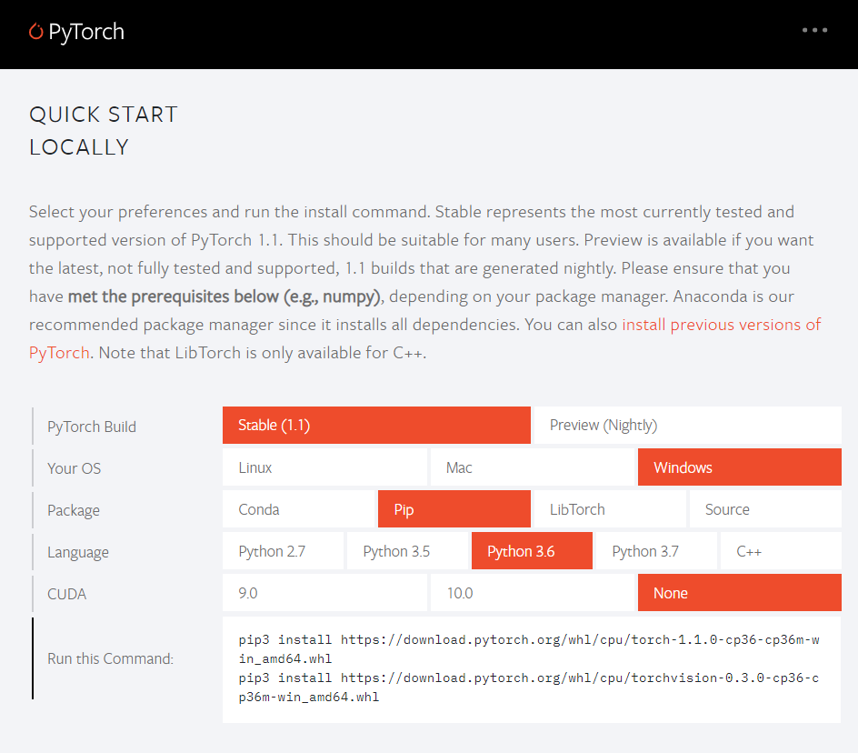
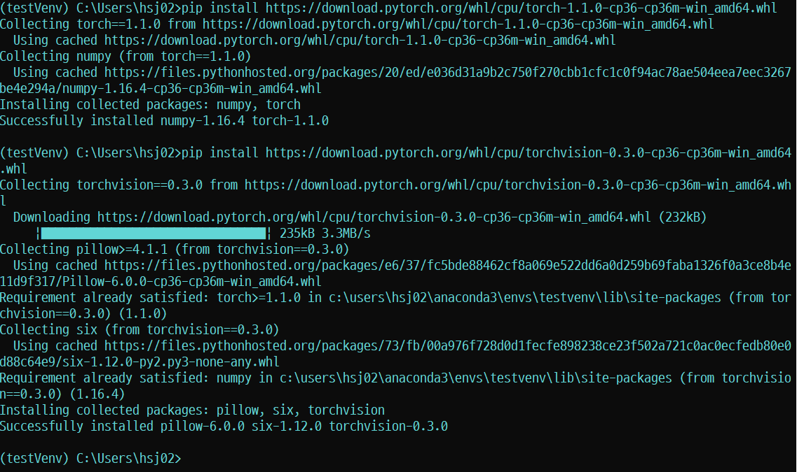

# Pytorch Project

##### `/Pytorch_Yolo`

##### `/Pytorch_Audio`

## Index

1. 개요
2. 아나콘다 설치
3. 가상환경 구성
4. Pytorch 설치


## 1. 개요

* **정보통신** 30217 허성진
* **프로젝트** 5조
* **주제** : 밥 먹어, 시바
* **개발환경** : Window10, Anaconda3, 


## 2. 아나콘다 설치

> **Anaconda**없이 **Python3**만 설치한다면, 모듈들이 업데이트될 때, 버전충돌의 문제가 생기는데, 그것을 해소할 수 있다.
>
> > 또한, 가상환경을 구성하여 여러 버전과 라이브러리를 갖춘 **Python3**를 사용할 수 있다.


설치 사이트 : [Anaconda Install](https://www.anaconda.com/distribution/)

- ##### 위 사이트에 접속하여 Window - 64bit 파일을 설치한다.


* ##### 대부분 Next 혹은 Accept를 선택하고, 환경변수 부분까지 넘어간다.


* ##### 환경변수 설정 부분에서는 그림의 박스 부분을 체크한다. (아나콘다를 환경변수에 추가하는 설정이다. 체크를 안하면 수동으로 추가를 해야한다.)


* ##### 설치완료


## 3. 가상환경 구성

> **가상환경**을 사용하는 이유는, 특정 프로젝트에서 필요한 패키지나 버전이 다르기에 새로운 환경을 구성하여 사용할 수 있도록하기 위함이다.
>
> > **Conda**를 이용하여 가상환경을 구성할 것이다.


* ##### 설치한 Anaconda Prompt를 실행한다.


- ##### conda 패키지 업데이트

  ​	프롬프트를 실행하면 다음과 같은 **CLI**창이 떠오른다. 파일 경로는 현재 사용자의 경로가 표시되고, 맨 좌측에는 **(base)**로 현재 활성화된 환경이름이 출력된다.(현재는 base로 기본환경이다.)

  

  ```shell
  (base)C:\Users\(username)> conda update
  ```

  `conda update`를 입력하여 conda패키지를 업데이트한다.

  

- ##### 가상환경 생성

  ​	가상환경을 생성한다. 이때 __Python__을 특정 버전으로 지정하여 설치할 수 있다.`(python = 3.6)`

  ```shell
  (base)C:\Users\(username)> conda create -n (가상환경 이름) python=3.6
  ```

  실행 예시는 다음과 같다.

  

  `y`를 입력하여 진행하면 생성이 된다.

  다음은 설치장면이다.

  


- ##### 가상환경 활성화/비활성화

  ```shell
  (base)C:\Users\(username)> conda activate (가상환경 이름)
  ```

  `conda activate`를 통해 설치 되어있는 가상환경에 접속(활성화)할 수 있다. 활성화가 되었을 경우 다음과 같이 명령줄 맨 좌측에 **활성화된 가상환경명**이 표시된다.

  ```shell
  (testVenv)C:\Users\(username)> conda deactive
  ```

  이와 같이 `conda deactivate`를 사용하여 가상환경에서 탈출(비활성화)할 수도 있다.

  

## 4. Pytorch 설치

> **Pytorch**는 **Facebook의 인공지능 연구팀**이 개발한 **Python을 위한 오픈소스 머신러닝 라이브러리**이다. **다양한 모듈을 제공**한다. 
>
> > **그래프 형태**가 **Tensorflow**와 달리 **동적으로 생성**된다는 장점이 있다.


설치 사이트 : [Pytorch.org](www.pytorch.org)

- ##### 위 사이트에 접속한 뒤, 자신의 환경에 맞게 체크를한다

  저자의 경우 

  - **Python** = 3.6
  - OS = Windows
  - PIP를 사용할 예정
  - GPU가 없기에 당연히 CUDA도 없음

  위와 같은 이유로 다음과 같이 설정하였다.

  


- ##### pip를 사용하여 Pytorch 설치

  ```shell
  (testVenv)C:\Users\(username)> pip install --upgrade pip
  ```

  **pip를 업그레이드** 한다. 결과는 다음과 같다.

  

  (이미 최신 버전이라 저런 결과가 나왔다.)


​		[Pytorch.org](www.pytorch.org) 의 `Run this Command`부분의 명령줄을 복사하여 실행하면 환경에 맞는 **Pytorch가 설치**된다.

