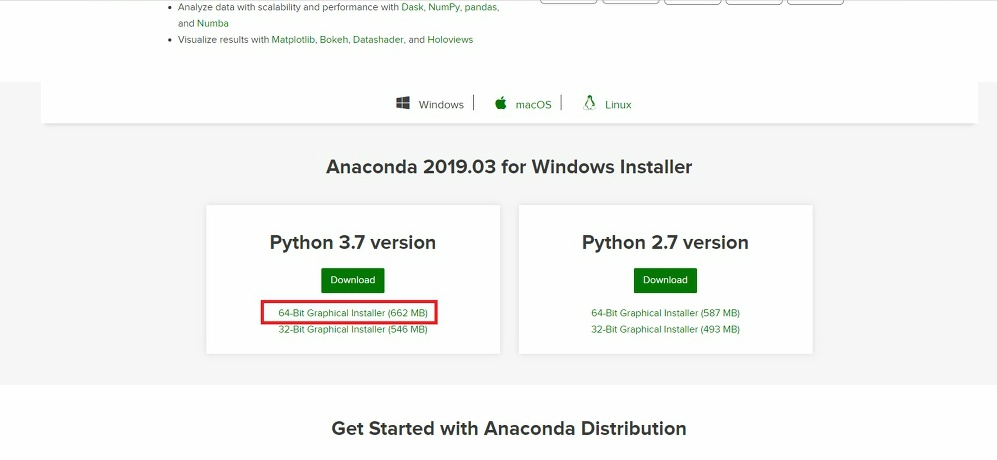
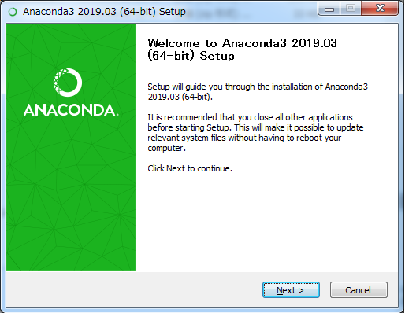
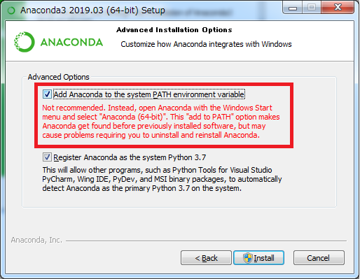
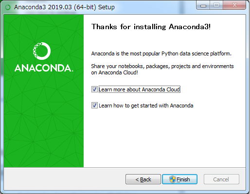
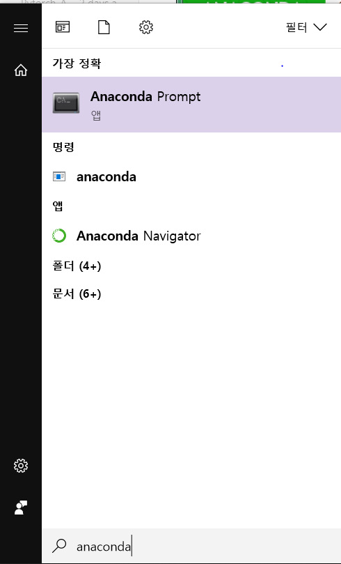

# Pytorch Project

##### /Pytorch_Yolo, /Pytorch_Audio

## Index

1. 개요
2. 아나콘다 설치
3. 가상환경 구성
4. Pytorch 설치

## 1. 개요

* 정보통신 30217 허성진
* 프로젝트 5조
* **주제**: 밥 먹어, 시바
* **개발환경** : Window10, Anaconda3, 

## 2. 아나콘다 설치

> **Anaconda**없이 **Python3**만 설치한다면, 모듈들이 업데이트될 때, 버전충돌의 문제가 생기는데, 그것을 해소할 수 있다.
>
> > 또한, 가상환경을 구성하여 여러 버전과 라이브러리를 갖춘 **Python3**를 사용할 수 있다.

[Anaconda Install](https://www.anaconda.com/distribution/)

- 사이트에 접속하여 window - 64bit 파일을 설치한다.

* 대부분 Next 혹은 Accept를 선택하고, 환경변수 부분까지 넘어간다.

* 환경변수 설정 부분이다. 그림의 박스 부분을 체크한다.

* 설치완료

## 3. 가상환경 구성

> **가상환경**을 사용하는 이유는, 특정 프로젝트에서 필요한 패키지나 버전이 다르기에 새로운 환경을 구성하여 사용할 수 있도록하기 위함이다.
>
> > **Conda**를 이용하여 가상환경을 구성

* 설치한 Anaconda Prompt를 실행한다.

## 4. Pytorch 설치

